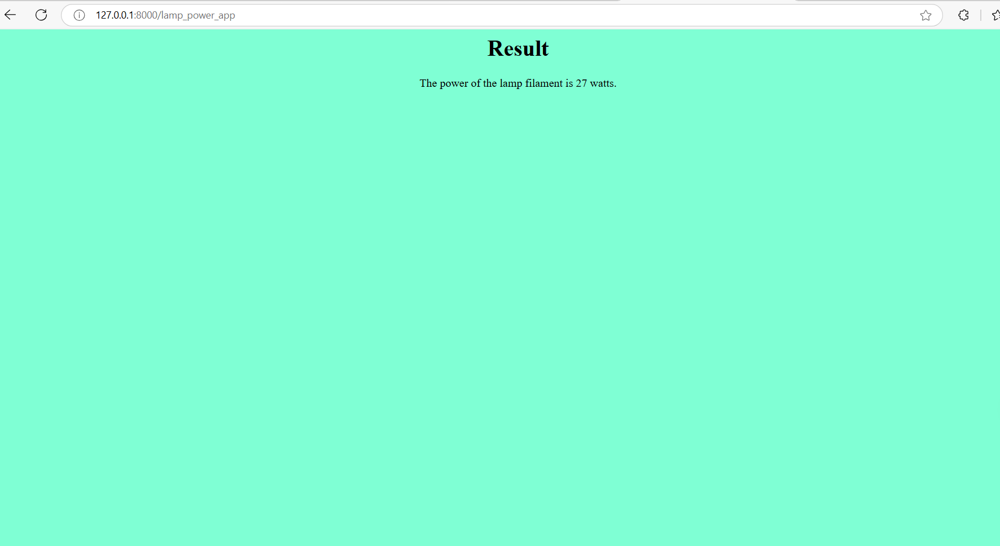
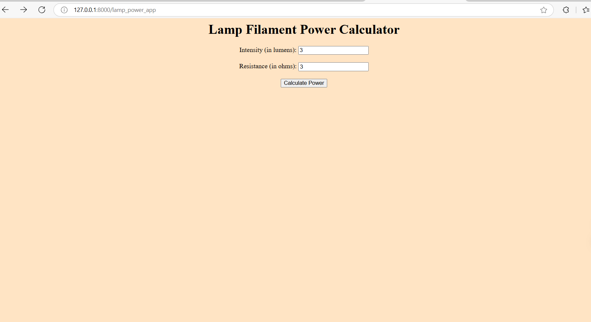

# Ex.05 Design a Website for Server Side Processing
# Date:08-11-2024
# AIM:
To design a website to calculate the power of a lamp filament in an incandescent bulb in the server side.

# FORMULA:
P = I2R
P --> Power (in watts)
 I --> Intensity
 R --> Resistance

# DESIGN STEPS:
## Step 1:
Clone the repository from GitHub.

## Step 2:
Create Django Admin project.

## Step 3:
Create a New App under the Django Admin project.

## Step 4:
Create python programs for views and urls to perform server side processing.

## Step 5:
Create a HTML file to implement form based input and output.

## Step 6:
Publish the website in the given URL.

# PROGRAM :

# views.py

    from django.shortcuts import render

    def calculate_power(request):
        if request.method == 'POST':
            intensity = int(request.POST.get('intensity'))
            resistance = int(request.POST.get('resistance'))
            power = ((intensity)*(intensity))*resistance
            return render(request, 'result.html', {'power': power})
        return render(request, 'index.html')

# urls.py 

    from django.urls import path
    from . import views

    urlpatterns = [
        path('', views.calculate_power, name='calculate_power'),
    ]

# SERVER SIDE PROCESSING:

# HOMEPAGE:

# RESULT:
The program for performing server side processing is completed successfully.
